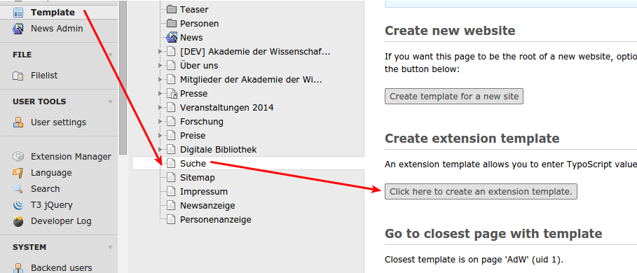

.. ==================================================
.. FOR YOUR INFORMATION
.. --------------------------------------------------
.. -*- coding: utf-8 -*- with BOM.

.. include:: ../../Includes.txt

.. _admin_template:

Einbindung res doctae
=====================

Um die folgenden Einstellungen vorzunehmen, benötigt man einen Admin-Account. Sie beziehen sich größtenteils auf Konfigurationen im Template einer Seite.

Erstellung eines Extension Templates
------------------------------------

Im TYPO3 Seitenbaum muss auf der Seite, auf der das res doctae eingebunden werden soll ein Extension Template erstellt werden. Dazu klickt man in der TYPO3 Modulleiste
auf "Template" und anschließend auf "Click here to create an extension template".

In dem erstellten Template klickt man auf "Setup" und fügt die Zeilen ein:

::

	plugin.tx_xmlinclude.settings.useRealURL = 1

	plugin.tx_xmlinclude.settings.parser = html
	plugin.tx_xmlinclude.settings.URLParameters.MINXML=true
	plugin.tx_xmlinclude.settings.URLParameters.locale-attribute=de

	[globalVar = GP:L = 1]
		plugin.tx_xmlinclude.settings.URLParameters.locale-attribute=en
	[global]

	plugin.tx_xmlinclude.settings.showDebugInformation = 0

Erstellung Seiteninhaltselement
-------------------------------

Um den Inhalt einer res doctae URL darzustellen, muss ein Inhaltselement vom Typen Plugin erstellt werden, Als Plugin
wird "Include XML" ausgewählt. Die Start URL ist im Format 

::

	http://rep.adw-goe.de/handle/11858/00-001S-0000-0023-9538-D?MINXML&locale-attribute=en

anzugeben, der :code:`Teil handle/11858/00-001S-0000-0023-9538-D` ist die entsprechende TeilURL der einzubindenenden Sammlung aus res doctae.

Als Base URL ist

::

	http://rep.adw-goe.de/
