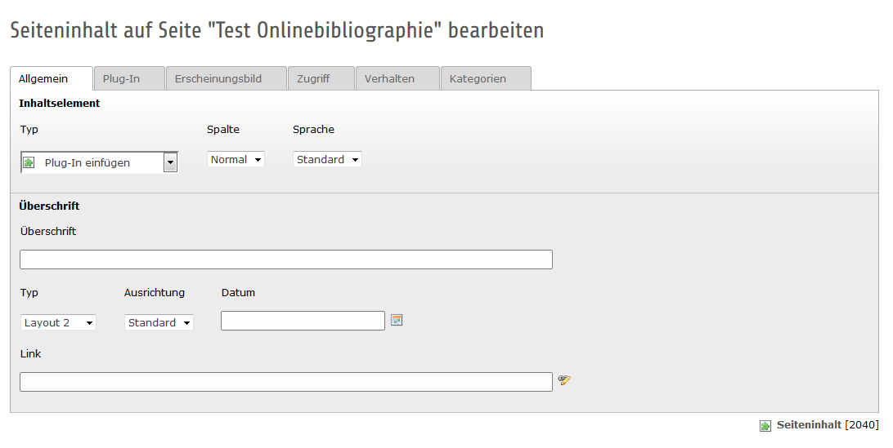
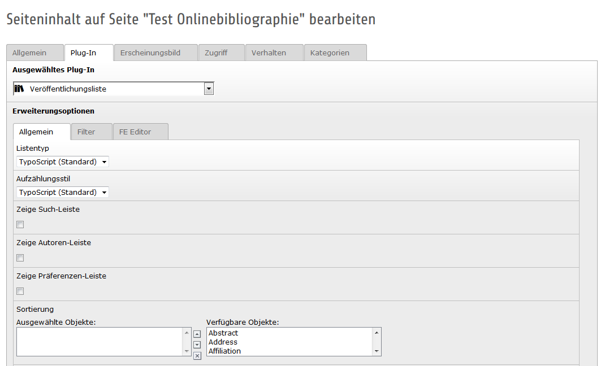
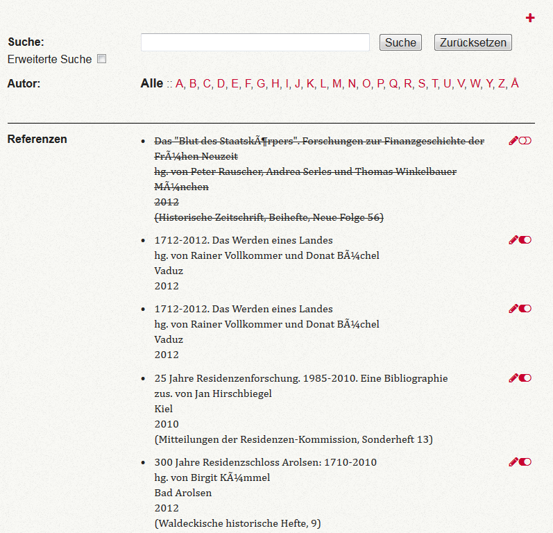
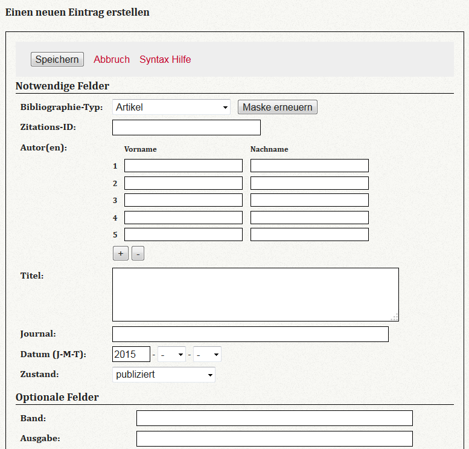
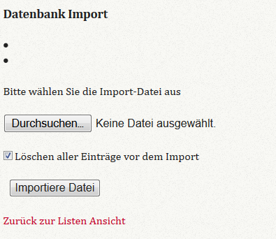

.. ==================================================
.. FOR YOUR INFORMATION
.. --------------------------------------------------
.. -*- coding: utf-8 -*- with BOM.

.. include:: ../../Includes.txt

.. _bib:

9 Onlinebibliographie
=====================
Die Onlinebibliographie stellt Literatur im AdW-Portal dar. 

9.1 Bib-Extension einbinden
---------------------------
Die Onlinebibliographie wird in Form einer Extension in das AdW-Portal eingebunden. Dazu wird ein Seiteninhaltselement "Plug-In einfügen" ausgewählt.

Unter dem Tab "Plug-In" wird dann die Extension "Veröffentlichungsliste" ausgewählt. Damit ist die Extension als Inhaltselement auf der Seite eingefügt.

9.2 Bib-Extension administrieren
--------------------------------
Die Extension bietet zahlreiche Möglichkeiten zur Einstellung. Im folgenden werden die Wichtigsten erläutert.

Die Extension kann über die drei Tabs "Allgemein", "Filter" und "FE-Editior" administriert werden.

**Wichtige Einstellungen:**

Damit die Suche im Frontend Ergebnisse anzeigt, müssen im Backend bei "Allgemein" im Feld "Search Fields" die Felder ausgewählt werden, in denen die Suche erfolgen soll.

Wenn der FE-Editor genutz werden soll, um über das Frontend Einträge durchzuführen oder Datensätze zu ändern, muss bei "FE-Editor" ein Hacken bei "Aktiviere Editer?" erfolgen.

9.3 Einträge einfügen
---------------------

9.3.1 Einzelne Datensätze mit dem Editor aufnehmen
~~~~~~~~~~~~~~~~~~~~~~~~~~~~~~~~~~~~~~~~~~~~~~~~~~
Wenn einzelne Datensätze angelegt werden sollen, kann das über das FE erfolgen. Dabei ist eine Voraussetzung, dass man als Redakteurin/Redakteur im BE eingeloggt ist und die Seite im FE mit https aufruft. Damit ergeben sich die Möglichkeiten neue Datensätze anzulegen bzw. bestehende zu editieren.

Mit dem Plus oben rechts öffnet sich der FE-Editor, über den ein neuer Datensatz angelegt werden kann.

9.3.2 Import von Datensätzen
~~~~~~~~~~~~~~~~~~~~~~~~~~~~
Bitte Beachten: Es gibt keine Dublettenerkennung. Wenn Datensätze importiert werden, die es bereits gibt, wird ein weiterer Eintrag in die Bibliographie geschrieben.

Für einen Import muss man wie oben genannt vorgehen. Einloggen ins BE und FE mit https aufrufen. Unten auf der Seite befindet sich die Möglichkeit zum Import.

Wenn ein gesamter Import stattfinden soll, also die alten Einträge überschrieben, dann muss dein Häckchen bei "Löschen aller Einträge vor dem Import" gesetzt sein.

9.4 Template anpassen
---------------------
Das Template wird für die Darstellung der Listenansicht und der Detailansicht verwendet. Aktuell kann das Template nur von der SUB angepasst werden. 