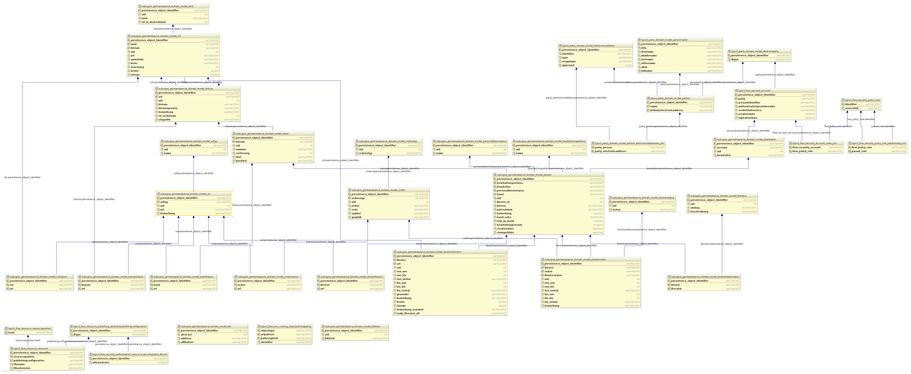
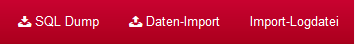
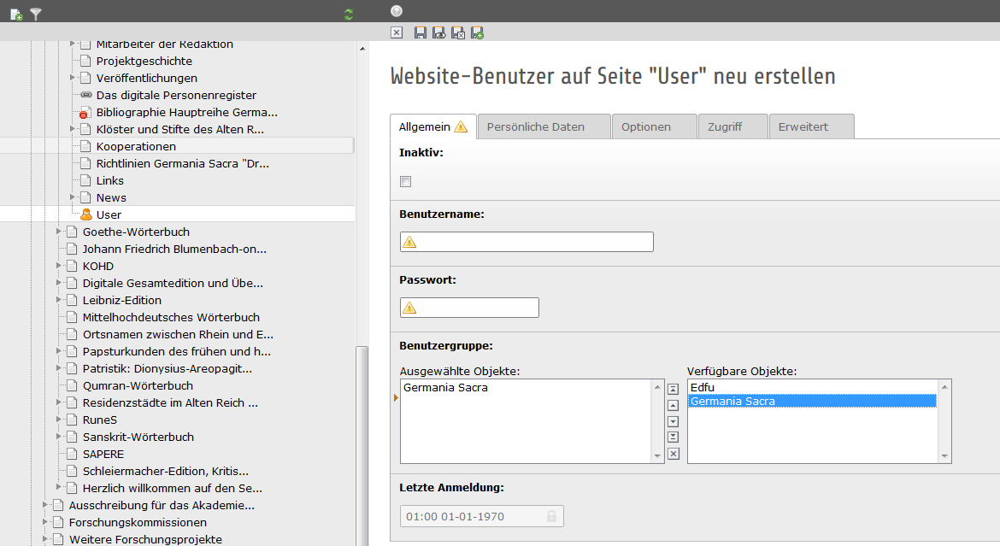

.. ==================================================
.. FOR YOUR INFORMATION
.. --------------------------------------------------
.. -*- coding: utf-8 -*- with BOM.

.. include:: ../Includes.txt

.. _WerkzeugmodusGS:

13 Werkzeugmodus: Germania Sacra
================================

Dateien
-------

GeoJSON
~~~~~~~
Die GeoJSON Datei kann direkt in GitHub aktualisiert werden.

Dazu muss ein FORK des Repositoriums https://github.com/subugoe/typo3-tmpl_adw angelegt werden. Die Datei kann in dem Ordner https://github.com/subugoe/typo3-tmpl_adw/tree/master/Resources/Public/Images/GermaniaSacra/Bistumsgrenzen angepasst und dann per Pull Request an die SUB gesendet werden.

Klöster-Marker
~~~~~~~~~~~~~~
Die Klöster-Marker können direkt in GitHub aktualisiert werden.

Dazu muss ein FORK des Repositoriums https://github.com/subugoe/typo3-tmpl_adw angelegt werden. Die Datei kann in dem Ordner https://github.com/subugoe/typo3-tmpl_adw/tree/master/Resources/Public/Images/GermaniaSacra angepasst und dann per Pull Request an die SUB gesendet werden.

Ämter-Liste
~~~~~~~~~~~
Die Ämter-Liste liegt als CSV-Datei (Einträge müssen durch ein Komma getrennt sein) auf dem Webspace der Personendatenbank. Durch das Export-Skripte (auch bei der Personendatenbank) wird eine Aktualisierung angestoßen. Beim nächsten regelmäßigen oder manuellen Update des SOLRs der Klosterdatenbank sind die Änderungen in der Klosterdatenbank übernommen.

Literatur
~~~~~~~~~

Die Literatur für die Klosterdatenbank wird über die Bib-Extension im AdW-Portal verwaltet. 

Genutzt wird die Onlinbibliographie, die im Seitenbaum beim Vorhaben liegt und die ID 588 hat. Die gesamten Einträge daraus sind für die Klosterdatenbank zu nutzen. Änderungen und Anlegen von neuen Datensätzen erfolgt über das AdW-Portal. Die Seite "Bibliographieinterface" (ID=654) ist für die Darstellung im BE notwendig und darf nicht verändert oder gelöscht werden.

Anlegen von neuen Datensätzen
+++++++++++++++++++++++++++++

Einzelne Datensätze
###################
Wenn nur einzelne Datensätze angelegt werden sollen, kann das über das FE erfolgen. Dabei ist eine Voraussetzung, dass man als Redakteurin/Redakteur im BE eingeloggt ist und die Seite im FE mit https aufruft (https://adw-goe.de/index.php?id=588). 

Import von mehreren Datensätzen im BibTeX Format
################################################

Bitte Beachten: Es gibt keine Dublettenerkennung. Wenn Datensätze importiert werden, die es bereits gibt, wird ein weiterer Eintrag in die Bibliographie geschrieben.

Für einen Import muss man wie oben genannt vorgehen. Einloggen ins BE und FE mit https aufrufen. Unten auf der Seite befindet sich die Möglichkeit zum Import.

Datenmodell
-----------

Inkrementeller Import
---------------------
* Die Datei mit dem Namen „inkKlosterDump.sql“ muss auf dem geschützten Github-Account „GermaniaSacra-dumps“ (https://github.com/subugoe/GermaniaSacra-dumps) abgelegt werden. Dazu muss das Repositorium geforkt werden und die Datei muss dann mit einem Pull-Request an die SUB "gesendet" werden. Die Struktur der Datei geht aus der vorhandenen Beispieldatei auf Github hervor.
* Zum Importieren der Daten klickt man im DIM der Klosterdatenbank den Menüpunkt „Daten-Import“ auf der oberen Menüleiste rechts an. Die Daten werden dann automatisch vom GitHub in die GS-Datenbank (Klostertabelle) importiert.
* Im Anschluss befindet sich (ebendfalls im DIM) eine Log-Datei, die über den letzten Import informiert.

SOLR
----

Der SOLR der Klosterdatenbank aktualisiert sich automatisch einmal am Tag (nachts). DAmit sind alle Neueinträge und Änderungen aus dem DIM im FE sichtbar. 

Weiterführende Informationen:

* find Extension allgemein: https://github.com/subugoe/typo3-find#find
* TYPO3 find Konfiguration für Germania Sacra: https://github.com/ssp/typo3-find-germania-sacra#typo3-find-configuration-for-germania-sacra
* SOLR: http://adw-dev.tc.sub.uni-goettingen.de/solr/#/

Suche
-----
Suchfunktionen
~~~~~~~~~~~~~~

* bei Eingabe von mehreren Worten besteht eine UND Verknüpfung
* es besteht auch die Möglichkeit einer AND NOT und OR Verknüpfung
* in den Orten müssen die Suchbegriffe nicht ausgeschrieben sein (automatische Ergänzung) ?!??

Trunkierung
~~~~~~~~~~~

* das Fragezeichen (?) für genau ein Zeichen
* das Sternchen (*) bzw. das Prozentzeichen (%) für beliebig viele (auch null) Zeichen

erweiterte Suche
~~~~~~~~~~~~~~~~

Karten
------

* Welches Kartenmaterial wird genutzt (FE und BE)? 
* Welche Lizenzen?

Linked Data
-----------

Für die Ausgabe der Klosterdaten werden verschiedene Linked Data Formate angeboten.

* RDF/XML
* Turtle
* json-ld

Die Anpassungen der Formate kann nur durch die SUB vorgenommen werden.

FE-Rechtemanagement
-------------------

Das Rechtemanagement für die FE-Zugänge erfolgt über das TYPO3-BE. Die Nutzerverwaltung ist unter Germania Sacra mit der ID=641 zu finden. Dort können neuen Website-Benutzer angelgt werden. Sie müssen der Benutzergruppe "Germania Sacra" zugewiesen sein.

